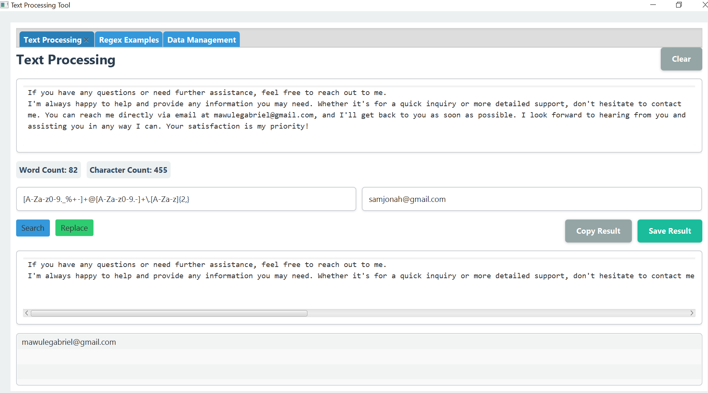
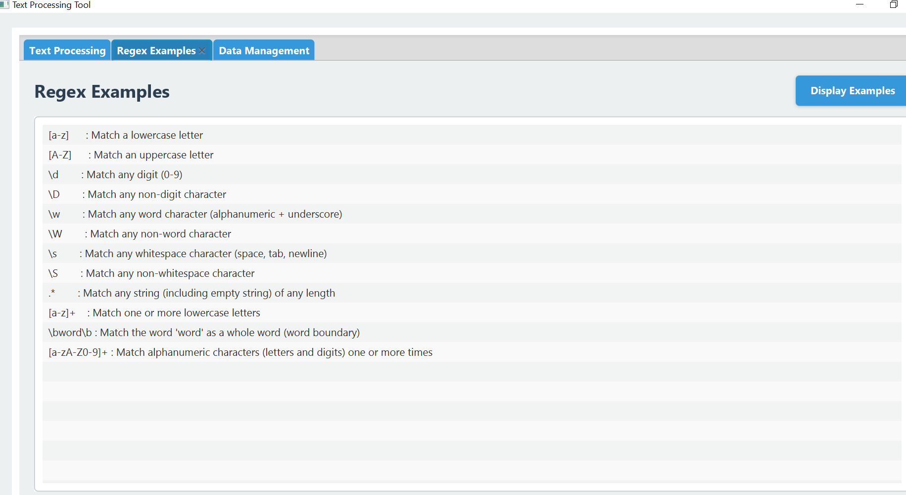
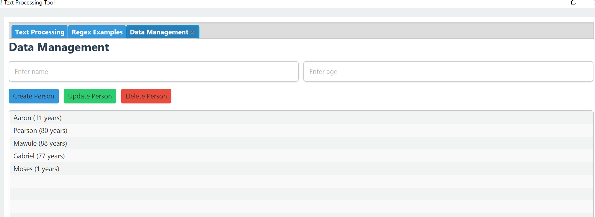

# Text Processing and Data Management Tool built with <a href="https://openjfx.io/" target="_blank">JavaFX</a> and <a href="https://www.java.com/en/" target="_blank"> JAVA

## Overview
The Text Processing and Data Management Tool is a versatile application designed to help users efficiently perform various operations on text data. It leverages regular expressions for powerful text parsing, searching, and pattern matching. Additionally, the tool provides robust functionality for manipulating and managing collections of data using Java collections (e.g., lists, sets, maps), making it ideal for handling structured or unstructured data in a variety of formats.

## Major Features 🔑
### Text Processing Tab View

The Text Processing Tab provides users with an easy-to-use interface for working with text and regular expressions. It features a text area for entering the text to be processed, and a separate input field for specifying the regex pattern to search for or replace. Users can also enter a replacement word to substitute matched patterns in the text.
The interface displays useful information such as the word count and character count of the input text. Additionally, it offers several options for managing results, including buttons to save the output, copy it to the clipboard, or clear all entered data at once. This tab makes it simple to perform text manipulation tasks, whether you're searching, replacing, or saving your results.


### Regex Examples
The Regex Examples tab offers a helpful resource for users to get started with regular expressions. By clicking the Display Examples button, users can access a collection of commonly used regex patterns for various text-processing scenarios. These examples serve as a reference to help users construct their own custom regex patterns for tasks such as searching, matching, or replacing text.
This feature is especially useful for those new to regular expressions or those looking for quick solutions to common text manipulation challenges.
.



### Data Management Tab View
The Data Management Tab allows users to interact with Java collections, enabling them to create and manage a collection of Person objects, each with a name and age. Users can add new persons to the collection, and update or delete existing ones. The update and delete actions are only possible if the person exists in the collection; if no match is found, the operation cannot be performed.
This tab uses a HashSet to ensure that only unique persons are stored and displayed, preventing duplicates in the collection.



## Technical Stack
- Java
- JavaFX
- MySQL/PostgreSQL


## Prerequisites
- JDK 17 or higher
- MySQL/PostgreSQL 
- Maven
- IDE (IntelliJ IDEA recommended)

  

## Installation
1. Clone the repository
```bash
git clone https://github.com/mawule-gabriel/TextProcessingTool.git


